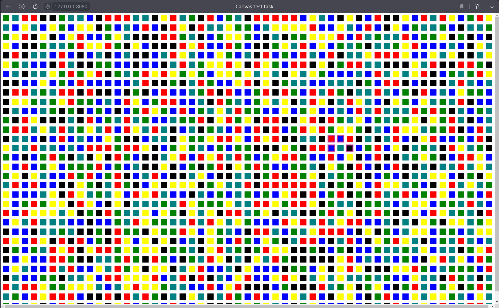

# Тестовое задание

> Задача по отрисовке канвас области с геометрическими фигурами(квадрат) и изменении цвета при клике на любом из них

> 1. Отрисовать область в канвас
> 2. Заполнить область равными квадратами(количество квадратов входящих в область можно расчитать самостоятельно, но не менее 1000шт)
> 3. Цвет квадратов должен быть рандомный
> 4. При клике на квадрат цвет любого из квадратов в области, должен быть изменен(на любой рандомный, не обязательно по порядку)
>
> UDP: реализация должна быть на TypeScript/JavaScript без дополнительных библиотек/фреймворков

## Установка

В составе dev зависимостей есть live-server. Чтобы его установить выполните команду

```bash
npm i
```

## Запуск

Запустить можно через установленный live-server:

```bash
npm run ls
```

Или любым другим live-server`ом

## Использование

После старта сервера при переходе на соответствующий url приложение выглядит так:



Если размер окна недостаточен для отрисовки 1000 квадратов, то отобразится уведомление:


При клике на квадрат он меняет цвет и обводится рамкой:


_Если честно я так и недопонял про "любой квадрат" поэтому слделал изменение цвета тому, на который кликнули_

## Примечание

Коммиты разбиты по версиям:

**V1** - JavaScript пока готов этот

**V2** - TypeScript я не работал с TS в проектах без бандлеров, надеюсь закончу в ближ время.

## V2 апдейт

для поддержки асинхронных модулей ("module": "AMD" - насколько я понял это актуально) добавил _require.js_. Как обойтись без него не понял пока.

Исходники TS в /src

Общее затраченное время около 6 часов.

## V3 апдейт

перeделан Event listener - остался один обший на весь Container

Добавлены ветки:

- webpack
- vite
